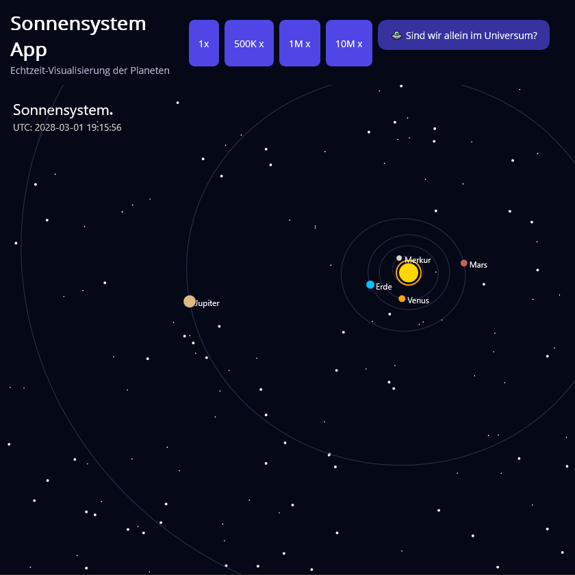

# SonnensystemApp 🌌

Eine moderne Desktop-Anwendung zur Visualisierung des Sonnensystems in Echtzeit, entwickelt mit .NET MAUI.

## 🛸 Projektbeschreibung

Die **SonnensystemApp** stellt die Planeten unseres Sonnensystems in einer interaktiven 2D-Visualisierung dar.  
Die Positionen der Planeten werden auf Basis realer astronomischer Daten berechnet.

Die Anwendung wurde mit Fokus auf saubere Architektur, Benutzererlebnis und Erweiterbarkeit entwickelt.

## ✨ Funktionen

- 🌍 Echtzeit-Visualisierung der Planetenpositionen
- ⏩ Zeitbeschleunigung (1x bis 10.000.000x)
- 🔍 Zoom mit dem Mausrad
- 🖱️ Drag & Pan Navigation
- 🪐 Darstellung elliptischer Umlaufbahnen
- 🇩🇪 Lokalisierung (deutsche Planetennamen)
- 🛸 Interaktive Easter Egg Animation (UFO Fly-by)

## ⛏️ Technischer Ansatz

- **.NET MAUI** für plattformübergreifende UI
- **Custom Rendering** über `IDrawable` (Canvas)
- Nutzung von **[Astronomy Engine (CosineKitty)](https://github.com/cosinekitty/astronomy)** zur Berechnung realer Planetenpositionen
- Trennung von:
  - Rendering (Drawable)
  - Logik (Services)
  - UI (XAML)

## 🏗️ Architektur

Die Anwendung folgt einem klaren, modularen Aufbau:

- `Graphics/` → Rendering (SolarSystemDrawable)
- `Services/` → Astronomische Berechnungen
- `Models/` → Datenstrukturen (PlanetPosition)
- `MainPage` → UI + Interaktionslogik

## 🎯 Ziel des Projekts

Dieses Projekt wurde entwickelt, um:

- Kenntnisse in **C# und .NET MAUI** zu demonstrieren
- Interaktive Visualisierungen umzusetzen
- Saubere Softwarearchitektur anzuwenden
- Ein portfolio-taugliches Beispiel für moderne Desktop-Anwendungen zu erstellen

## 👨‍💻 Autor

Entwickelt von [@vito4real](https://github.com/vito4real)
